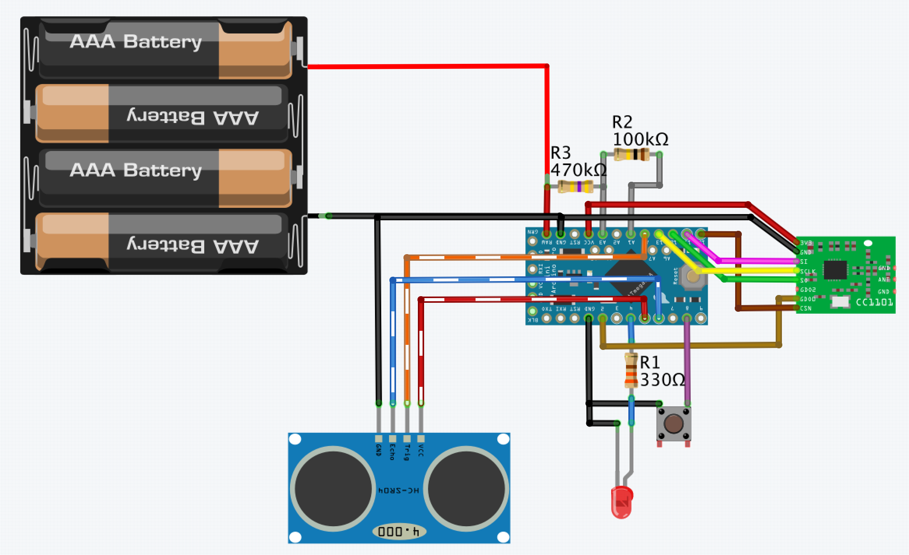

# HB-UNI-Sen-LEV-US
#### Füllstandsensor für HomeMatic

Um die Geräteunterstützung zu aktivieren, wird die aktuellste Version des [JP-HB-Devices Addon](https://github.com/jp112sdl/JP-HB-Devices-addon/releases/latest) benötigt!

#### Bauteile
- Batteriehalter für 3 oder 4 Batterien
- Ultraschallsensor:
  - z.B. [JSN-SR04T V2.0](https://de.aliexpress.com/item/Integrated-Ultrasonic-Module-Distance-Measuring-Sensor-Module-Reversing-Radar-Waterproof/32312190912.html)
    - **Hinweis:** Unbedingt die **V2.0** nehmen, weil diese auch mit 3.3V zuverlässig arbeitet!
  - oder MaxBotix [MB1040](https://de.aliexpress.com/item/NEW-Mini-uav-obstacle-avoidance-ultrasonic-ranging-module-MB1040-High-Performance-Sonar-Range-Finder/32862912642.html)
  
- [CC1101 (868MHz)](https://de.aliexpress.com/item/CC1101-Wireless-Module-Long-Distance-Transmission-Antenna-868MHZ-M115-For-FSK-GFSK-ASK-OOK-MSK-64/32635393463.html) 
- [Arduino Pro Mini 3.3V/8MHz](https://de.aliexpress.com/item/Free-Shipping-1pcs-pro-mini-atmega328-Pro-Mini-328-Mini-ATMEGA328-3-3V-8MHz-for-Arduino/32342672626.html)
- Kleinteile...
  - 1x LED
  - 1x Taster
  - Widerstände, je 1x 330 Ohm, 100kOhm, 470kOhm

#### Verdrahtung

